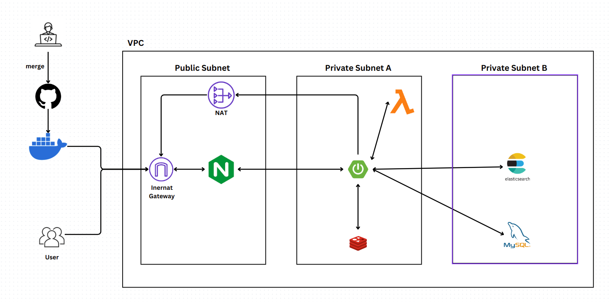

# 너는 사진만 올려! 분류는 내가 할게 : 낭만
카카오톡 같은 채팅 어플로 사진을 올리게 되면 내 사진이 무엇인지 일일이 구분하여 다운로드 하여야 합니다. 
낭만은 사진을 그룹에 올리게 되면, 사진을 공유하는 것 뿐만 아니라 사진에 등장인물을 테그해 룬류하여 내가 나온 사진을 쉽게 찾을 수 있게 해줍니다.

# 기술 스택

# 개발 기간 및 인원
- 24.07 ~ 24.09
- 백엔드 6명, 프론트엔드 5명, 안드로이드 4명

# 내 역할 
- 사용자가 사진을 업로드 시, 서버리스에서 얼굴 이미지를 임베딩 한 후, 임베딩 벡터를 ElasticSearch에 저장

# 아키텍처

# 사연 영상

### 인공지능 람다 서버 코드
- [낭만 람다 서버](https://github.com/redblackblossom/Na-o-man_AI)